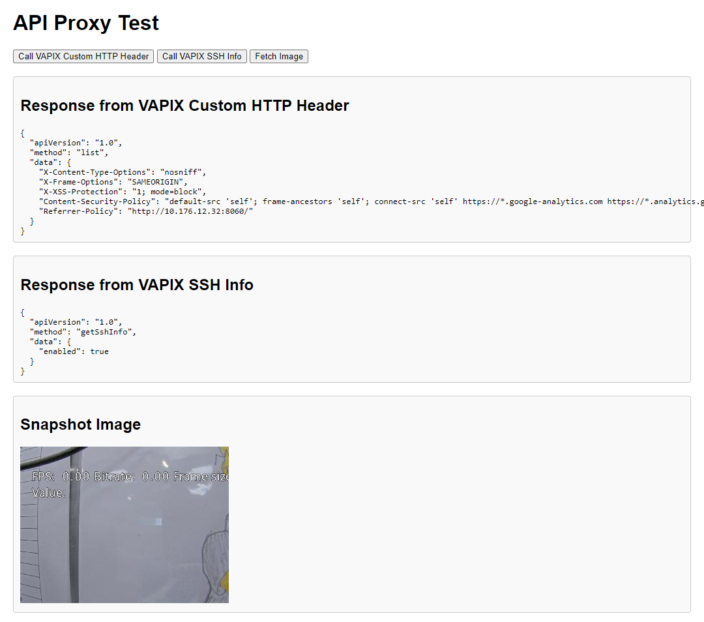

# How to call APIs from HTML page by using local proxy server:



```bash
mkdir local-proxy
cd local-proxy
npm init -y
npm install express
```

```bash
npm install express node-fetch

```

```bash
node server.js
```
